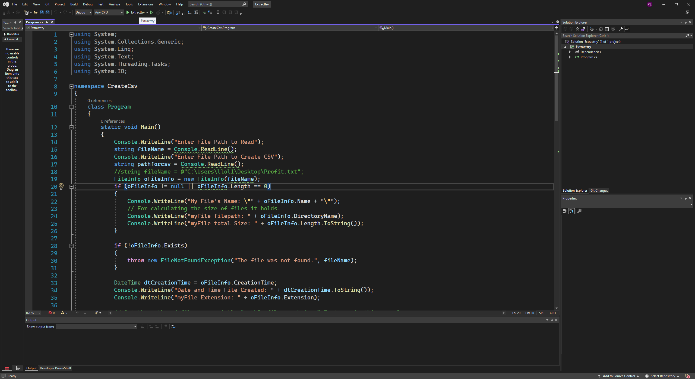
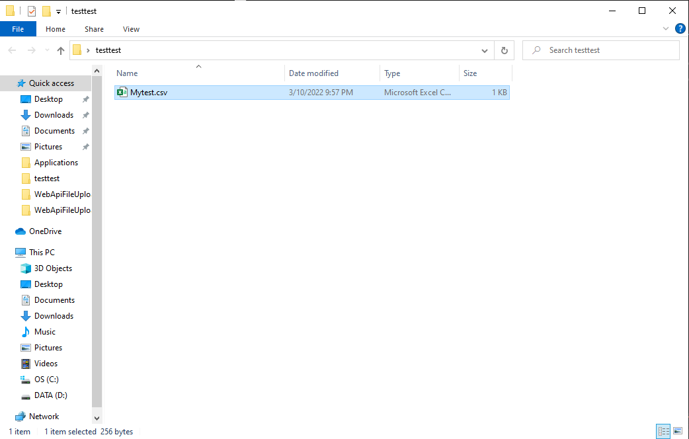
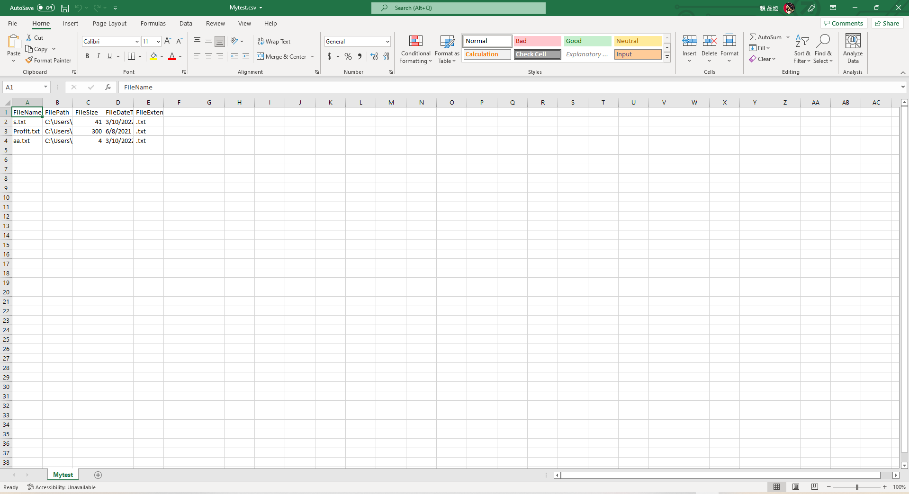

# Extract Files Metadata and write into a .CSV file Also check out File upload/download to Azure repo which has the combination of both.

 To run the program, open in Visual Studio and run 

 if the first step is run correctly the command prompt should pop up asking two paths 

 Lastly check your file path and check the csv file

